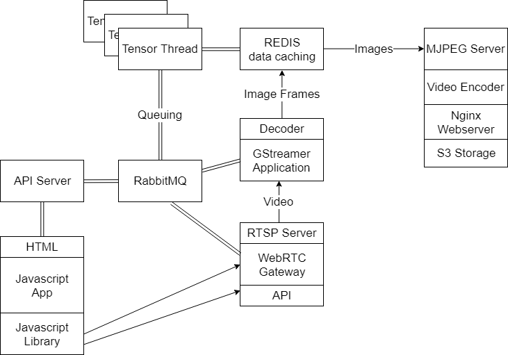

# Ooblex
Deployable system for real-time streaming distributed processing, targeting mainly live media and neural network inference.

## Basic System Layout


## Server Requirements

Ooblex is comprised of several services, including those for media and inference. While these services can be run independently, they can also be run together on a single server enviroment.

Ooblex was developed for use on a server with a solid internet connection, an Intel 28-core CPU, and 16-GB of RAM. System requirements will vary greatly depending on application, however our goal is to allow for deployment onto even edge devices, such as a Raspberry Pi 3 with an attached Intel Movidous AI accelerator.

A domain name is required for a full installation as SSL is often required for WebRTC browser support. Point a valid domain (or subdomain) at your public server's IP address. I might recommend Namecheap.com and searching for something for $1 that you can use if just testing. 

It is also recommended that all ports be made available and open to the server, as port tunneling and WebRTC TURN servers are out of scope of the provided support here. 

## Installing onto Ubuntu 18.04

We're are assuming a working and fresh deployment of a Ubuntu server, logged in as the root user in this example.

If a GRUB error occurs during installation, you may need to load the maintainer's default. Please see: https://askubuntu.com/questions/1040974/ubuntu-server-18-04-apt-get-fails

Otherwise, start by entering the following commands, line by line, into the Ubuntu terminal.

```
cd ~
sudo apt-get update
sudo apt-get install git
git clone https://github.com/ooblex-ai/ooblex/

cd ooblex
sudo chmod +x *.sh

sudo ./install_opencv.sh
```
We should now be building OpenCV, which can take 30 minutes to a few hours to install.
```
sudo ./install_nginx.sh
```
During the NGINX install, it will request information about a domain name to generate a free SSL certificate. As mentioned in the requirements above, you will need to have a domain name pointing at your server for this to work. Also, if asked, redirecting from HTTP to HTTPS is preferred.
```
sudo ./install_tensorflow.sh
sudo ./install_gstreamer.sh
sudo ./install_janus.sh
sudo ./install_webrtc.sh
sudo ./install_redis.sh
```
The dependencies for Ooblex are largely now installed as we have now installed several core components. You will still need to deploy a REDIS and RabbitMQ server of your own though. If you are deploying to the cloud, your cloud provider may offer these as hosted services. 

We can enter the code directory now and configure some final settings.

Edit the config.py file so that it uses 'your' REDIS and RabbitMQ uri is used. Also, you will need enter the domain name used when configuring the SSL certificate earlier.

You can edit the config.py with the following command:
```
sudo nano config.py
```
or use vim if you are cool enough to know how to use that.

Next, let's test things out:
```
cd ~/ooblex/code
python3 api.py
```
Running the api.py file with Python should now start the main API server, however there are several other services that we will need to run.  You can stop this server for now, or push it to the background ie) control-Z & bg

Next, lets copy the files in the HTML folder to your /var/www/html folder.

``` 
sudo cp ~/ooblex/html /var/www/html
```

You will need to MODIFY both the index.html file AND the Ooblex.v0.js file contained within the JS folder
You will need to update the domain names from api.ooblex.com to whatever your domain is.
At this point, going to your domain in your browser should show a yellow website. 

Next, in ~/ooblex/code, we can try running our next service:

```
cd ~/ooblex/code
python3 decoder.py
```

Any error about image folders can be ignored at this point. If things otherwise works, great! You will likely want to modify the file so that the REDIS and AMPQ connection strings point to your own servers, rather the Ooblex's demo servers.

You will also need to test mjpeg.py.  This will also require the SSL certificate location to be properly configured.

```
python3 mjpeg.py
```

Other than NGINX, with the HTML files, you will need to have the following servers running at the same time.

```
sudo /opt/janus/bin/janus -o & python3 api.py & python3 brain.py & python3 decoder.py & python3 mjpeg.py & python3 webrtc.py &
```
webrtc.py will fail if Janus is also not started and configured first.  Please see the Janus_config folder for instructions on how to configure Janus.  Start the Janus once configured using the following command, and then try starting webrtc.py again.
```
sudo /opt/janus/bin/janus -o
```

or a one liner for everything
```
cd  ~/ooblex/code/
sudo /opt/janus/bin/janus -o & python3 api.py & python3 brain.py & python3 decoder.py & python3 mjpeg.py & python3 webrtc.py &
```

Ensuring that Janus's socket server layer works is required to get webrtc.py working also. 

Lastly, once the system is all configured, and each of the several servers are running all together, it is possible to modify the brain.py file, which contains the tensor threads.

The brain.py is configured to operate with a popular video-based facial recognition Tensorflow models, along with some face transformation models (Trump, Taylor), which can be downloaded as needed and implemnted. 

Due to the size of the models, they cannot be hosted directly on github, but they can be downloaded from here: https://api.ooblex.com/models/

Automate the download of all models with the following:
```
cd ~/ooblex/
wget --recursive --no-parent -nH https://api.ooblex.com/models
```

If setup correctly, along with the remote model files, the HTML files we hosted (the yellow website) should enable the Ooblex Demo to work.

### Tensor Threads

The tensorthread_shell.py is a template for your own AI scripts: it is what brain.py uses for its own demo code. It is quite accessible if you're familiar with Python and Tensorflow already. Working with IBM's Watson Studio, exporting a Python-based version of a trained model can be directly imported into this tensorthread_shell.py file for rapid deployment of a high performing, low-latency, serialized model-- virtually no coding needed.

brain.py, or tensorthread_shell.py for that matter, can be distributed and run across many servers. Just repeat the above setup steps but instead just run brain.py (or tensorthread_shell.py), without any of the other services loaded on that new server. The Tensor Threads will work on AI tasks from the main REDIS/RabbitMQ queue and accelerate the overall system's processing performance!  It can easily also be run on Windows or deployed to virtually any system that supports Python and Tensorflow (or TensorRT).

### OpenVINO

Tensor Threads do not need to use TensorFlow, nor AI logic in general, so what is loaded into them can vary based on your needs. We have successfully validated that OpenVINO, Caffe, PyTorch, and TensorRT, can replace Tensorflow within these Tensor Threads for deployment of the code onto even embedded devices. 

### Advanced

While the above install is pretty rudementry, Ooblex was designed as a set of services that are loosely tied to each other. Running each component on its own server, or multiple copies of a single component across many servers, is easy to accomplish and allows for quite a bit of performance scaling. 

In this demo installation and deployment, we look at Ooblex working as a whole, but individual components can also bring value on their own. The WebRTC gateway is optional if receieving data from a remote security camera. The WebRTC component can also be used indepedently of the Tensor Threads, if live media streaming capabilities is all that is required.

Information on the core server files at play:
```
mjpeg.py -- JPEG streaming server for low-latency output. 

api.py -- The main REST API server, used for external communication with the Ooblex deployment and orchestrating many of the intenral system components.

brain.py -- This contains the Tensor Thread code as a wrapper for a Python-based TensorThread model. It is pre-configured with example logic. This particular script can be loaded onto many different machines, and as long as they have access to the RabbitMQ and REDIS server, they will assist in processing.

tensorthread_shell.py -- THIS IS A SIMPLIFIED version of the above brain.py file. It can be used as a bare bones framework for any PYTHON-based machine learning code.  Plug and play largely, with a very basic amount of sample code / boilerplate.

webrtc.py -- This is the main API layer for the the WebRTC service

decoder.py -- This is the main live media deocder thread, configured for live webRTC video ingestion.
```
pixel_shuffler.py, npy files, and model.py files support the alread-configured AI models loaded in brain.py. These can be modified or removed as needed, depending on changes to brain.py

tensorthread_shell.py does not actually run-- but it is used as an example / boilerplate to create your own custom tensorthread processes. Each Tensorthread can store in memory dozens or hundreds of models, assuming sufficient system RAM. 

### Future Work

We would like Tensor Threads to not need any touching at all, and would prefer models to be hosted in an on-demand database that Tensor Threads can pull from. This on-demand database would be accessible via a webinterface, which can allow for models to be uploaded as microservices or pulled directly from model training tools like IBM Watson. 

This system would also intelligently optimize the model being pulled to meet the architecture being deployed to: Intel CPU, FPGA, ARM, TPU, & Nvidia. Intelligent in-memory model caching and orchestrating of the Tensor Threads would adapt resources and processign demands as needed.

We would like to increase accessibility for data-ingestion devices, using simple images, including for the Raspberry Pi using WebRTC. We would also like to maintain cloud-hosted deployable one-click images of the system, so that anyone can have it up and running within moments.

We would like to develop a toolkit for embedded devices and mobile devices, to allow for flexible deployment of Ooblex, along with centralized remote management of deployments. 

Last but not least, increased readibility of the code, better seperation of the services, better virtual server support, and general code clean up is still all greatly needed.

